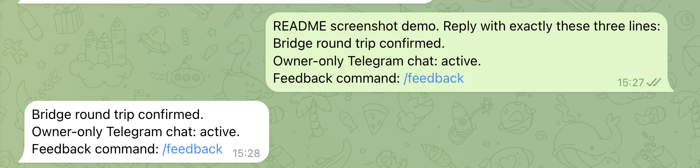
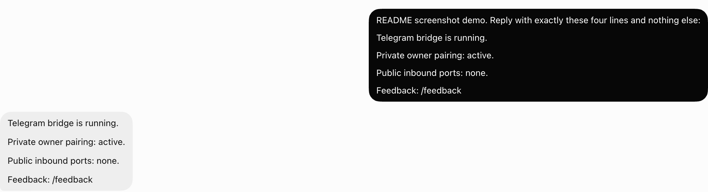

# Grok Bot Telegram private bridge

[English](#english) | [简体中文](#简体中文)

[](https://github.com/liush2yuxjtu/grok-bot-telegram-private-bridge/actions/workflows/ci.yml)
[](https://github.com/liush2yuxjtu/grok-bot-telegram-private-bridge/stargazers)
[](LICENSE)

> Unofficial project. xAI and Cursor do not support or endorse it. It relies on an undocumented loopback gateway inside the Grok Bot cloud computer. A Grok Bot update may break it.

## See it working / 运行效果

**Telegram Web.** The paired owner sends a safe demo request and receives the final Grok Bot reply through the bridge. The screenshot excludes the account sidebar, Bot username, and earlier messages.



**Grok Bot.** A separate sanitized status prompt shows the Grok Bot conversation surface. The screenshot excludes the sidebar and unrelated conversation history.



Telegram Web 展示已配对 owner 的真实双向往返。Grok Bot 展示安全状态对话。两张图都裁掉了账号侧栏、Bot 用户名和无关历史消息。

## English

This bridge lets one owner message an existing Grok Bot from a private Telegram chat. It runs inside the Grok Bot cloud computer. Your laptop, public webhooks, and inbound ports stay out of the message path.

This connects to an existing Grok Bot with its current conversation and cloud computer. It is not a Telegram client for the xAI model API.

```text
Telegram private chat
        |
        | Bot API long polling
        v
bridge on the Grok Bot cloud computer
        |
        | 127.0.0.1 only
        v
existing Grok Bot conversation
        |
        | final assistant reply only
        v
Telegram sendMessage
```

### What it does

- Accepts private text messages from one paired Telegram owner.
- Wraps Telegram text as untrusted external data before sending it to Grok Bot.
- Returns only the new final assistant reply.
- Keeps Telegram and gateway credentials in regular, non-symlink `0600` files.
- Refuses to start if the Telegram bot already has a webhook.
- Persists Telegram offsets and owner pairing in a `0600` state file.
- Restarts the Node process after a crash.
- Adds `/feedback` links for stars, discussions, and compatibility reports.
- Uses Node.js standard library only. There is no `npm install` step.

### Requirements

- An existing Grok Bot whose cloud computer and local gateway already work.
- Node.js 20 or newer in that cloud computer.
- A private Telegram bot created with [@BotFather](https://t.me/BotFather).
- A dedicated Grok Bot is strongly recommended. Concurrent routines in the same Bot can make final-reply correlation ambiguous.

### Install inside the Grok Bot cloud computer

Ask Grok Bot to open its own terminal, then clone the repository into its persistent home directory:

```bash
mkdir -p "$HOME/.local/share"
cd "$HOME/.local/share"
git clone https://github.com/liush2yuxjtu/grok-bot-telegram-private-bridge.git telegram-grok-bridge
cd telegram-grok-bridge
```

Create owner-only credential storage:

```bash
mkdir -m 700 -p secrets
install -m 600 /dev/null secrets/token
chmod 600 "$HOME/sand-data/gateway.json"
```

Enter the current BotFather token into `secrets/token` with a terminal editor or Grok Bot secure secret flow. Never paste it into ordinary chat, an issue, a discussion, or a commit. If a token has appeared in chat, revoke it in `@BotFather` before continuing.

For stable routing, set the exact existing Grok Bot name when starting:

```bash
export GROK_AGENT_NAME='My Telegram Bot'
```

If `GROK_AGENT_NAME` is unset, the bridge follows the currently active Grok Bot. That fallback is convenient for testing but unsafe when several Bots are active.

Run local checks, issue a ten-minute pairing command, and start the bridge:

```bash
npm test
npm run check
bin/pair
bin/start
bin/status
```

`bin/pair` prints a command like this:

```text
/pair <random-128-bit-code>
```

Send that command in a private chat with your Telegram bot. The code expires after ten minutes and allows five failed attempts.

### Telegram commands

| Command | Result |
| --- | --- |
| `/start` | Show binding state or resume a stopped owner session |
| `/pair <code>` | Bind one Telegram user and private chat |
| `/status` | Confirm that the paired session is running |
| `/stop` | Stop Telegram message forwarding without deleting the owner |
| `/feedback` | Open the repository, Discussions, and compatibility issue form |

### Process control

```bash
bin/start
bin/status
bin/stop
```

The wrapper restarts a crashed Node child with bounded exponential backoff. The observed Grok Bot image had no reliable user-level systemd or cron. After the entire VM or pod restarts, run `bin/start` again. See [supervisor notes](docs/supervisor.md).

### Security rules

- Keep `secrets/token`, `state.json`, and `gateway.json` at mode `0600`.
- The bridge rejects symlinked credential files.
- The gateway client always replaces its bind host with `127.0.0.1`.
- The bridge opens no inbound network port.
- Unpaired users cannot access feedback links, runtime status, or Grok Bot content.
- Inbound text is limited to 8 KiB.
- Tool traces, secrets, and earlier transcript entries are not returned to Telegram.
- Report vulnerabilities through [GitHub private vulnerability reporting](SECURITY.md), not a public issue.

### Known limits

- Private text chats only. No groups, media, voice, streaming, or inline mode.
- The Sand gateway is undocumented and may change without notice.
- Delivery is best effort. A crash after an offset is saved can lose a reply.
- Final-reply matching uses transcript changes around one turn. Use a dedicated Bot and avoid concurrent routines.
- Grok Bot settings, secret prompts, CAPTCHA, and rich approval widgets remain desktop-only.
- Full VM restart needs a manual `bin/start` on observed Grok Bot images.

### Tests

```bash
npm test
npm run check
```

Tests use local fake Telegram and gateway HTTP servers. They do not need real credentials or network access.

### Feedback

- [Star the project](https://github.com/liush2yuxjtu/grok-bot-telegram-private-bridge)
- [Share your setup or idea](https://github.com/liush2yuxjtu/grok-bot-telegram-private-bridge/discussions)
- [Report a compatibility problem](https://github.com/liush2yuxjtu/grok-bot-telegram-private-bridge/issues/new/choose)

Do not include tokens, pairing codes, chat IDs, user IDs, agent IDs, logs with message text, or private conversation content in feedback.

### Background and related work

- [Bilingual build and debugging case study](https://gist.github.com/liush2yuxjtu/6d7b597836aebdda3f1f664c6e03b1a2)
- [Cursor community discussion about external Grok Bot messages](https://forum.cursor.com/t/grok-bot-can-i-send-it-a-message-from-outside/168199)
- [Independent community bridge by SSBrouhard](https://github.com/SSBrouhard/grokbot-telegram-bridge)
- [Telegram Bot API](https://core.telegram.org/bots/api)

This repository was built independently from observed runtime behavior. The related bridge above covers more features and is worth comparing before choosing an implementation.

## 简体中文

这个桥让唯一 owner 从 Telegram 私聊现有 Grok Bot。它运行在 Grok Bot 自己的云端电脑内，不依赖 MacBook、Mac mini、公网 webhook 或入站端口。

它连接现有 Grok Bot 的对话和云端电脑，不是 xAI 模型 API 的 Telegram 客户端。

### 功能

- 只接受一个已配对 owner 的 Telegram 私聊文字。
- 把 Telegram 文字包成不可信外部数据，再交给 Grok Bot。
- 只返回本次请求新增的最终 assistant 回复。
- token、gateway 凭据和状态只保存在非符号链接的 `0600` 文件中。
- Telegram 已配置 webhook 时拒绝启动，不擅自删除 webhook。
- Node 子进程崩溃后自动重启。
- `/feedback` 返回 Star、Discussions 和兼容性问题入口。
- 只用 Node.js 标准库，不需要 `npm install`。

### 安装

在 Grok Bot 云端电脑终端执行：

```bash
mkdir -p "$HOME/.local/share"
cd "$HOME/.local/share"
git clone https://github.com/liush2yuxjtu/grok-bot-telegram-private-bridge.git telegram-grok-bridge
cd telegram-grok-bridge
mkdir -m 700 -p secrets
install -m 600 /dev/null secrets/token
chmod 600 "$HOME/sand-data/gateway.json"
```

通过终端编辑器或 Grok Bot 安全密钥流程，把新的 BotFather token 写入 `secrets/token`。不要把 token 粘贴到普通聊天、Issue、Discussion、PR 或 commit。token 曾出现在聊天中时，先到 `@BotFather` 撤销并重新生成。

建议指定唯一 Grok Bot 名称：

```bash
export GROK_AGENT_NAME='My Telegram Bot'
npm test
npm run check
bin/pair
bin/start
bin/status
```

把 `bin/pair` 输出的 `/pair <code>` 发给 Telegram Bot。配对码 10 分钟失效，最多允许 5 次失败。

### Telegram 命令

| 命令 | 作用 |
| --- | --- |
| `/start` | 查看绑定状态，或恢复已停止的 owner 会话 |
| `/pair <code>` | 绑定唯一 Telegram 用户和私聊 |
| `/status` | 检查配对会话是否运行 |
| `/stop` | 停止消息转发，但保留 owner |
| `/feedback` | 返回 Star、Discussions 和兼容性 Issue 入口 |

### 已知限制

- 只支持私聊文字，不支持群聊、媒体、语音、流式回复或 inline mode。
- Sand gateway 不是公开 API，Grok Bot 更新可能破坏兼容性。
- offset 落盘后发生崩溃时，可能丢失一次回复。
- 最终回复通过单次 turn 前后的 transcript 差异匹配。建议使用没有并发 routines 的专用 Bot。
- VM 或 pod 整体重启后，需要再次运行 `bin/start`。
- 设置、密钥输入、CAPTCHA 和富审批卡仍需打开 Grok Bot。

### 反馈

- [给项目 Star](https://github.com/liush2yuxjtu/grok-bot-telegram-private-bridge)
- [分享你的配置或想法](https://github.com/liush2yuxjtu/grok-bot-telegram-private-bridge/discussions)
- [报告兼容性问题](https://github.com/liush2yuxjtu/grok-bot-telegram-private-bridge/issues/new/choose)

反馈中禁止附带 token、配对码、chat ID、user ID、agent ID、真实对话或含消息正文的日志。

## License

[MIT](LICENSE)
